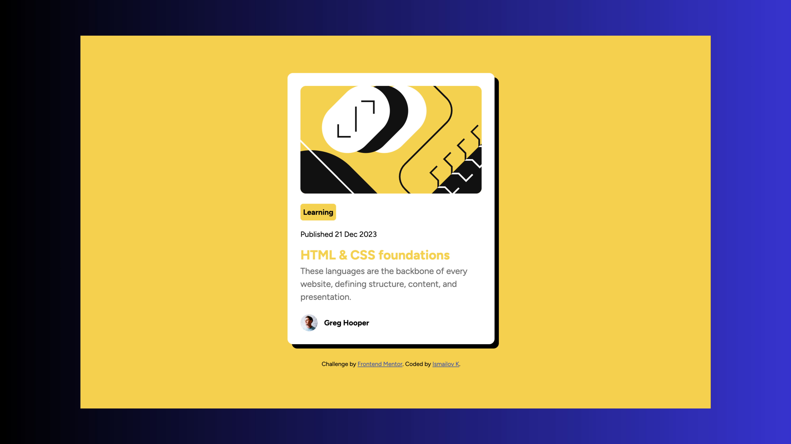

# Frontend Mentor - Blog Preview Card Solution

### Screenshot



This is a solution to the [Blog preview card challenge on Frontend Mentor](https://www.frontendmentor.io/challenges/blog-preview-card-ckPaj01IcS).

## Table of contents

- [Overview](#overview)
  - [The challenge](#the-challenge)
  - [Screenshot](#screenshot)
  - [Links](#links)
- [My process](#my-process)
  - [Built with](#built-with)
  - [What I learned](#what-i-learned)
  - [Continued development](#continued-development)
  - [AI Collaboration](#ai-collaboration)
- [Author](#author)

## Overview

### The challenge

Users should be able to:

- See hover and focus states for all interactive elements on the page


### Links

- Solution URL: [Add solution URL here](https://your-solution-url.com)
- Live Site URL: [Add live site URL here](https://your-live-site-url.com)

## My process

### Built with

- Semantic HTML5
- CSS3
- Flexbox
- Google Fonts (Figtree)
- Mobile-first workflow

### What I learned

Parent-child hover pattern — applying hover to the parent instead of the hidden element itself:
```css
.blog__container:hover .blog__category {
    display: inline-block;
}
```

Using `object-fit: cover` to properly fit images inside their containers:
```css
.blog__img img {
    object-fit: cover;
}
```

### Continued development

- CSS Grid
- JavaScript
- React

### AI Collaboration

- Used Claude (Anthropic) for debugging and code review
- All code was written by me — Claude helped identify errors and explain concepts

## Author

- Frontend Mentor - [@IsmailovK](https://www.frontendmentor.io/profile/IsmailovK)
